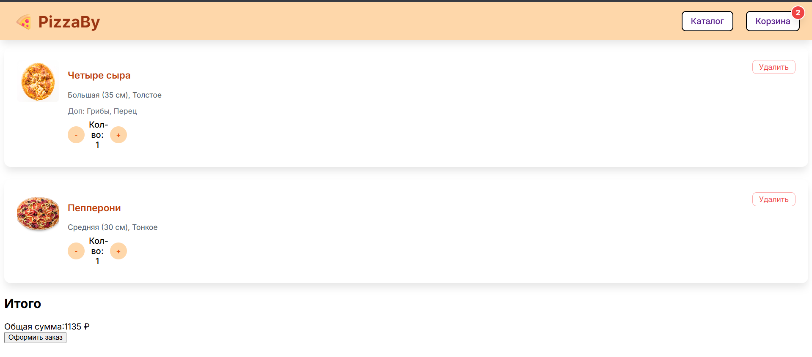
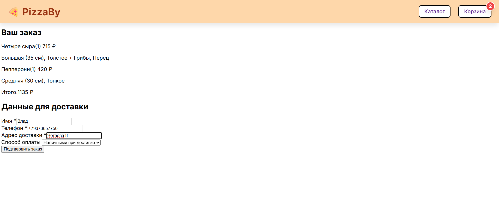
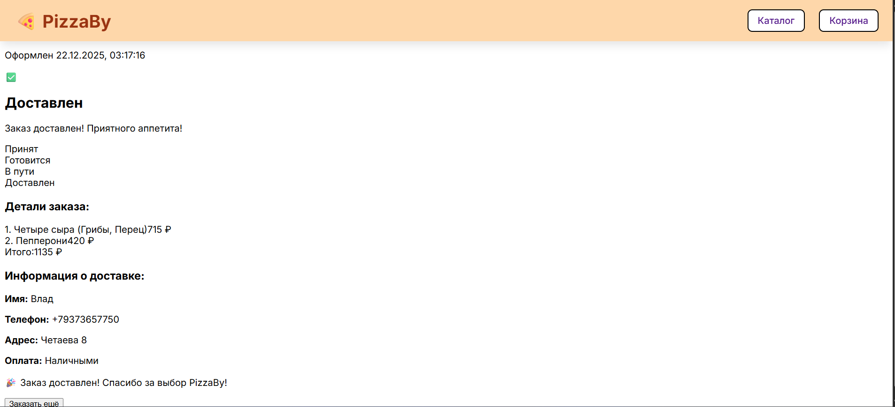

# PizzaBy — Заказ пиццы онлайн

PizzaBy — клиентское веб‑приложение для заказа пиццы, реализованное на React и TypeScript.

Ключевая функциональность

- Каталог пицц с описаниями и изображениями
- Конструктор пиццы (размер, тесто, дополнительные ингредиенты)
- Корзина с управлением количеством и удалением позиций
- Оформление заказа с формой доставки и выбором оплаты
- Страница отслеживания статуса заказа

Технологии

- React 19, TypeScript
- React Router (маршрутизация)
- TailwindCSS (стили)
- Vite (сборка и dev сервер)
- Jest + React Testing Library (тесты)
- ESLint + @typescript-eslint (статический анализ)

Установка и быстрый старт

1. Клонировать репозиторий и перейти в папку проекта:

```bash
git clone <repository-url>
cd pizzaby
```

2. Установить зависимости:

```bash
npm install
```

3. Запустить в режиме разработки:

```bash
npm run dev
```

Сборка для продакшена:

```bash
npm run build
```

Тесты и покрытие

- Запуск тестов для текущего пакета:

```bash
npm run test
```

- Запуск покрытия (coverage) для текущего пакета:

```bash
npm run test:coverage
```

- Запуск тестов для всех пакетов в workspace (из корня репозитория):

```bash
npm run test --workspaces
```

Линтинг и автофикс

- Запустить ESLint (проверка):

```bash
cd apps/web-app
npm run lint
```

- Автофикс (eslint --fix):

```bash
cd apps/web-app
npm run lint:fix
```

Архитектура монорепозитория

- `apps/web-app` — основное клиентское приложение
- `packages/shared` — общие типы и утилиты
- `packages/ui-kit` — UI-компоненты (повторное использование)

Правила разработки и стандарты

- Полная типизация TypeScript: использование `any` в проекте запрещено
- ESLint правила настроены на 2 пробела отступа и запрет на использование точек с запятой (`;`)
- Запрещены лишние пустые строки (максимум 1 подряд)

Качество и CI рекомендации

- Все тесты в проекте должны проходить без ошибок
- По крайней мере один компонент должен иметь покрытие тестами >= 90% (локально это уже проверяется для UI-компонентов)
- Запуск `npm run lint` должен давать 0 предупреждений и ошибок




